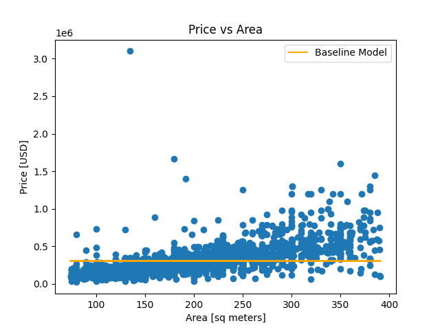

# Buenos Aires Housing Price Prediction Project

This project is focused on predicting housing prices in Buenos Aires based on various factors such as size, location, and neighborhood. The analysis is divided into several notebooks, each addressing different aspects of the prediction model.

## Notebooks Overview

### 1. Prepare Data (buenos-aires1.0.ipynb)
This notebook focuses on preparing the dataset for analysis. It includes data cleaning, handling missing values, and initial exploratory data analysis.

**Key Steps:**
- Imported 5 Buenos Aires property info Excel files.
- Plotted a histogram of the `surface_covered_in_m2` column and observed its skewness.
- Removed outliers by excluding the top and bottom 10% of `surface_covered_in_m2`.
- Built a data wrangle function to filter data for houses and remove outliers.

### 2. Predicting House Price with Size (buenos-aires2.0.ipynb)
This notebook explores the relationship between house size and price. Various regression models are applied to predict house prices based on the size of the property.

**Key Steps:**
- Filtered the dataset for houses and removed null values.
- Plotted the distribution of house sizes and a scatter plot of price vs. area.
- Calculated the correlation between `surface_covered_in_m2` and `price_aprox_usd` (0.6511).
- Built a baseline model (Mean house price: 304,824.49 USD, Baseline MAE: 143,357.58).
- Fitted a linear regression model and calculated the training MAE (92,515.77).
- Regression equation: `house_price = -29,587.53 + 1696.71 * surface_covered`.

**Visualizations:**

### 3. Predicting House Price with Location (buenos-aires3.0.ipynb)
This notebook investigates how the location of a property influences its price. It includes geographical analysis and visualization to understand location-based price variations.

**Key Steps:**
- Concatenated datasets 1 and 2.
- Plotted a mapbox location and price visualization, and a 3D scatter plot.
- Built and evaluated a linear regression model to predict house prices based on location.
- Baseline: Mean house price: 285,427.63 USD, Baseline MAE: 136,034.78.
- Model equation: `price = 279,991.86 + (-519.79 * longitude) + (729.02 * latitude)`.

**Visualizations:**

  
Interactive version: [Map](images/fig3.1_map.html)

  
Interactive version: [3D Scatter Plot](images/fig3.2_3d.html)
  
Interactive version: [3D Scatter Plot with Plane](images/fig3.3_3d.html)

### 4. Predicting Price with Neighborhood (buenos-aires4.0.ipynb)
This notebook delves into the impact of neighborhood characteristics on house prices. It examines socio-economic factors and other neighborhood-specific attributes.

**Key Steps:**
- Imported and cleaned data, extracting neighborhood information.
- Applied one-hot encoding to the neighborhood feature.
- Built and evaluated a Ridge regression model to handle potential overfitting.
- Baseline MAE: 144,036 USD, Training MAE: 122,533.66 USD.
- Identified the most significant neighborhoods affecting house prices.

**Visualizations:**

### 5. Explore (buenos-aires5.0.ipynb)
This notebook is dedicated to further exploratory data analysis, uncovering hidden patterns and insights within the dataset.

**Key Steps:**
- Dropped columns with more than 50% null values and low cardinality.
- Identified and removed leaky columns.
- Analyzed multicollinearity and removed less complete columns.

**Visualizations:**

### 6. Predicting Price with Size, Location, and Neighborhood (buenos-aires6.0.ipynb)
This comprehensive notebook combines size, location, and neighborhood factors to build a robust predictive model. It aims to provide a more accurate and holistic prediction of house prices.

**Key Steps:**
- Preprocessed and cleaned data from multiple sources.
- Combined features for a comprehensive model.
- Built and evaluated a model using one-hot encoding and Ridge regression.
- Created an interactive dashboard for user input and house price prediction.

## Getting Started

To run these notebooks, you will need to have the following Python libraries installed:
- pandas
- numpy
- matplotlib
- seaborn
- scikit-learn
- geopandas
- plotly
- category_encoders

## Data

The data used in this project includes various features such as:
- Property size (in square meters)
- Location (latitude and longitude)
- Neighborhood characteristics
- Socio-economic factors

## How to Use

1. Clone the repository.
2. Ensure you have all the necessary libraries installed.
3. Open each notebook in Jupyter Notebook or Jupyter Lab.
4. Run the cells sequentially to reproduce the analysis.

## Results

Each notebook provides detailed results and visualizations for the respective analysis. The final notebook combines all factors to give a comprehensive prediction model for housing prices in Buenos Aires.

## Conclusion

This project offers insights into the real estate market in Buenos Aires and demonstrates the application of various machine learning techniques for price prediction. By considering multiple factors, the models aim to provide accurate and reliable price estimates.

